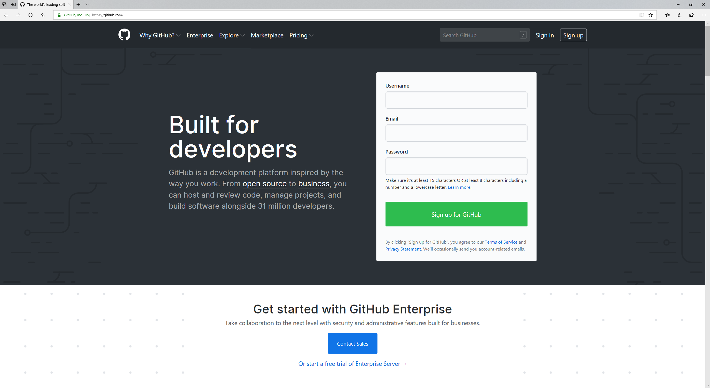
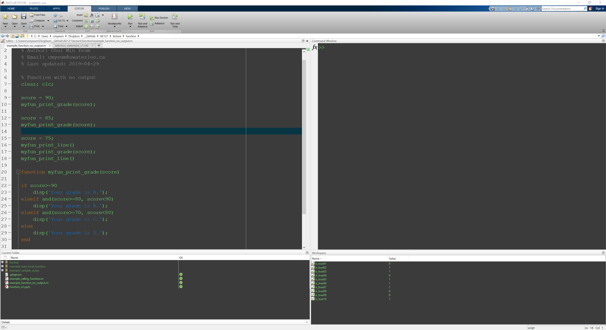
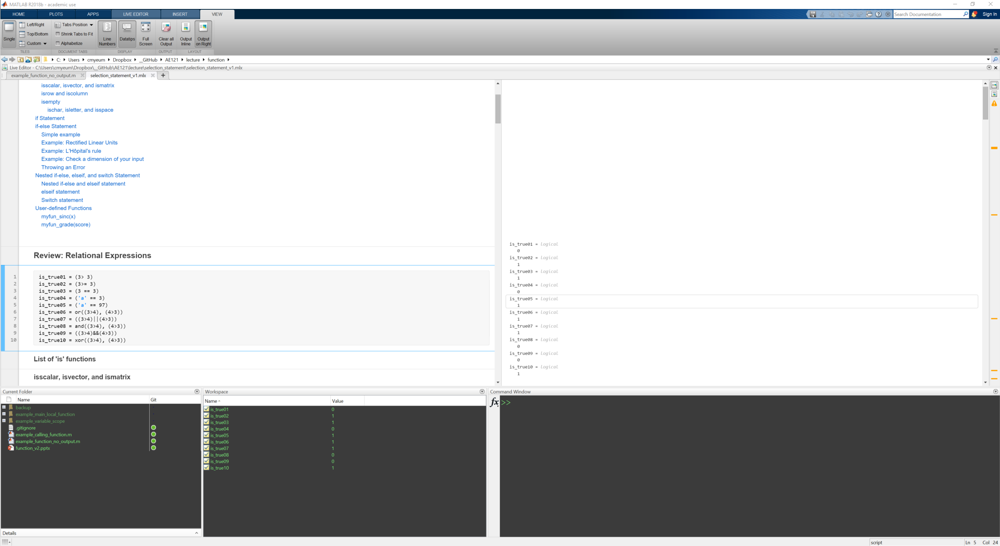
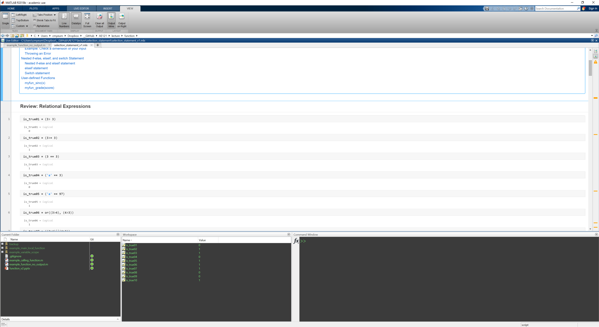
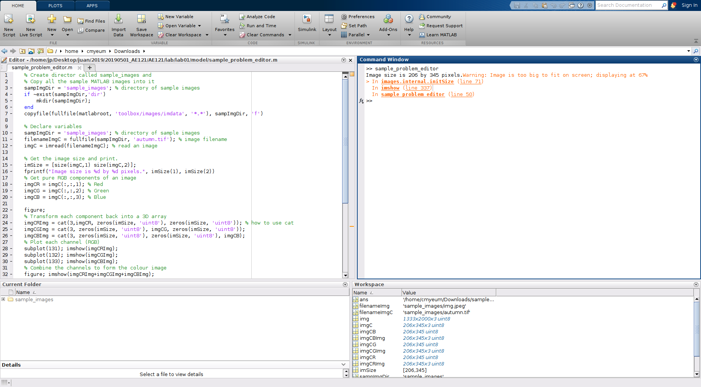
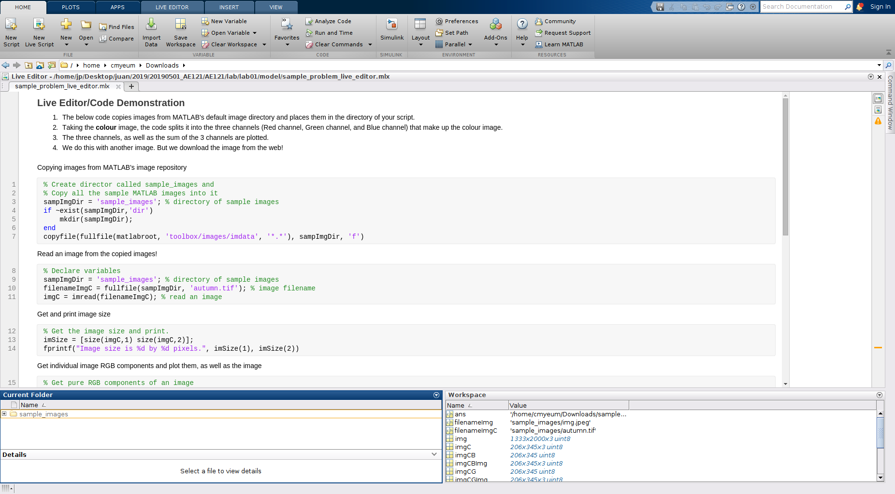
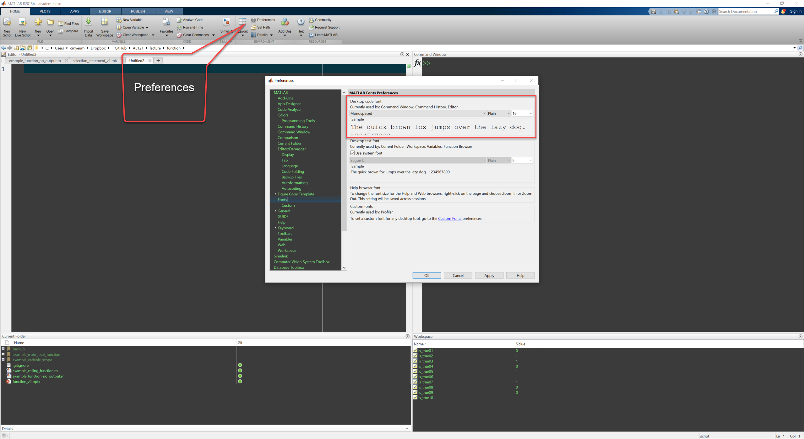
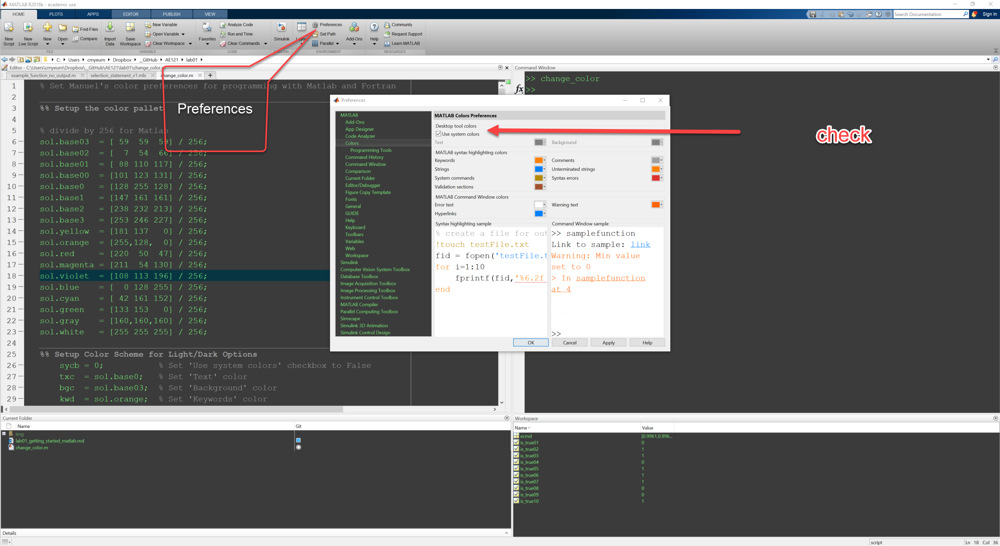
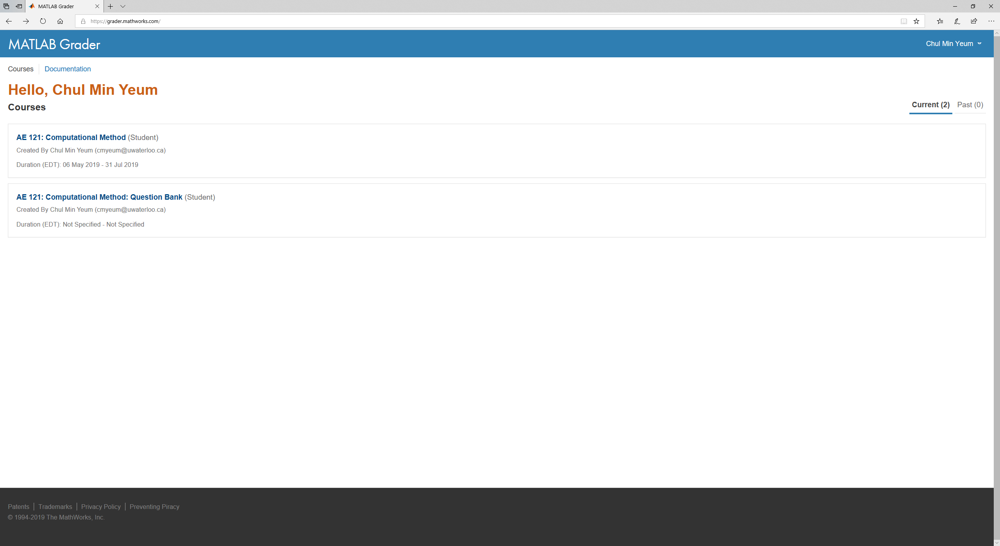
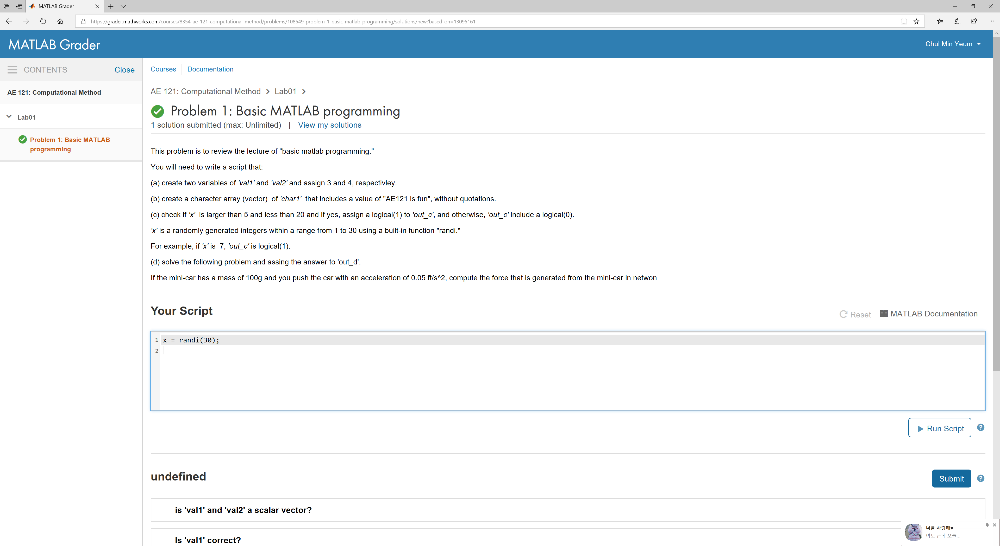

# Lab01: Getting Started With MATLAB

**Instructor:** Chul Min Yeum     
**TAs:** Jason Connelly and Juan Park  
**Date:** May 9, 2019   
**Last updated**: 2019-04-28

Please read, understand, and complete all the following sections.
## Table of Contents
- [Github Account Creation](#github-account-creation)
- [Recommended MATLAB Window Arrangements](#recommended-matlab-window-arrangements)
- [Editor and Live Editor](#editor-and-live-editor)
- [Preferences](#preferences)
- [MATLAB Grader Registration](#matlab-grader-registration)

## Github Account Creation
[**https://github.com**](https://github.com/)

>To post questions or comments, students should make their own Github account. Please sign up this website. Students **do not have to** make their accounts using **school emails** if they already have accounts or they want anonymity.

## Recommended MATLAB Window Arrangements
The following MATLAB window arrangements are recommended to provide an optimal programming environment.

### When you need to use both the editor and command windows (best for writing short scripts)

### When you are studying tutorials using the Live Editor

**Output on Right (recommended)** 

**Output inline**  

### When you are programming in general

### When you are using a small screen, you can minimize the Toolstrip. 

## Editor and Live Editor
Please look in the [model](model) folder for sample files.
### Simple program (editor)
Please run a simple program using the editor (Sample found [here](model/sample_problem_editor.m)).

### Simple program ([live editor](https://www.mathworks.com/products/matlab/live-editor.html)) 
Please run a simple program using the live editor.
[**See this page to examine the structure of the live editor**](sample_problem_live_editor.pdf)   
The actual live editor file is available [**here**](model/sample_problem_live_editor.mlx) for download.

### Editor Shortcut
Please repeat the above processes using the keyboard shortcuts

**script**  

`F5`: run all    
`Ctrl + Enter`: run section  
`Ctrl + R`: comment   
`Ctrl + T`: uncomment   
`Ctrl + I`: smart indent   
`Ctrl + J`: wrap comment 
`Ctrl + c`: stop   

### Live Editor Shortcuts
Please repeat the above processes using the keyboard shortcuts

**Text**  

`Alt + Enter`: insert code   
`Ctrl + Alt + Enter`: section break (important)   
`Ctrl + Scroll`: change text size (:+1: not possible in an editor)   
`Ctrl + B`, `Ctrl + I`, `Ctrl + U`: Bold, italic, and underline   
`Ctrl + Shift + 1,2,3`: heading level   

**Run**  

`Ctrl + Enter`: run section   
`F5`: run    
`F10` (`Ctrl + c` in command window): stop   

**Note:** General good practice is to [add semicolons at the end of each line of code](https://www.quora.com/When-and-why-do-we-use-semicolons-in-MATLAB) (;) to suppress the output to console. If you need to see the output of a line of code, do not place a semicolon at the end.

## Preferences 
### Change font size

### Change color scheme (eye fatigue)
Run `change_color.m`.

You can reset the color in your editor.

## MATLAB Grader Registration  

You will receive the following email:

### Solve a problem

Click AE 121: Computational Method

Please solve all the questions in problem 1.

**NOTE:** PLEASE SOLVE YOUR PROBLEM IN THE MATLAB EDITOR and CHECK YOUR SOLUTION THROUGH GRADER. 

